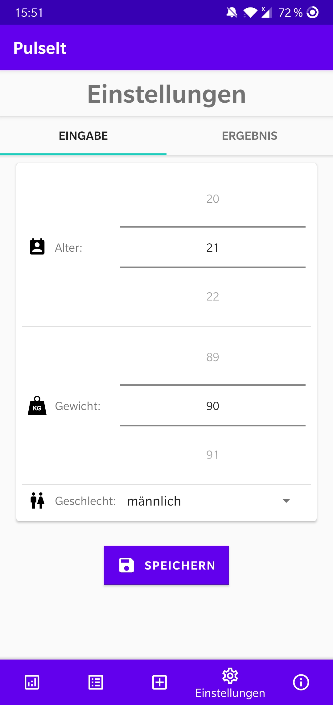
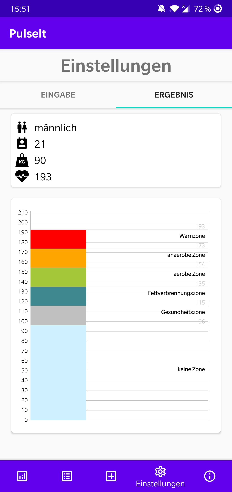
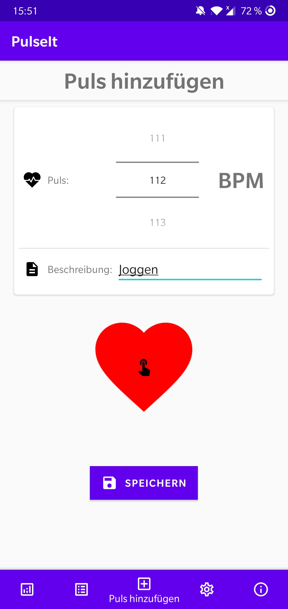
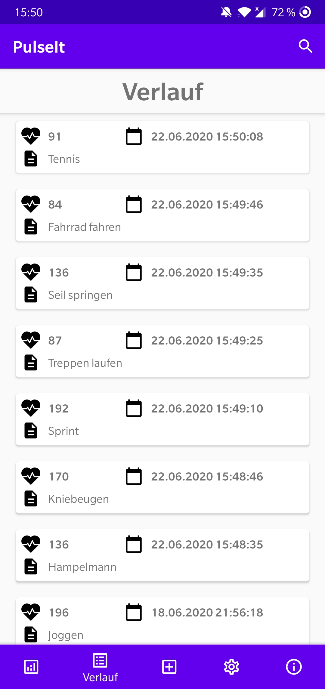
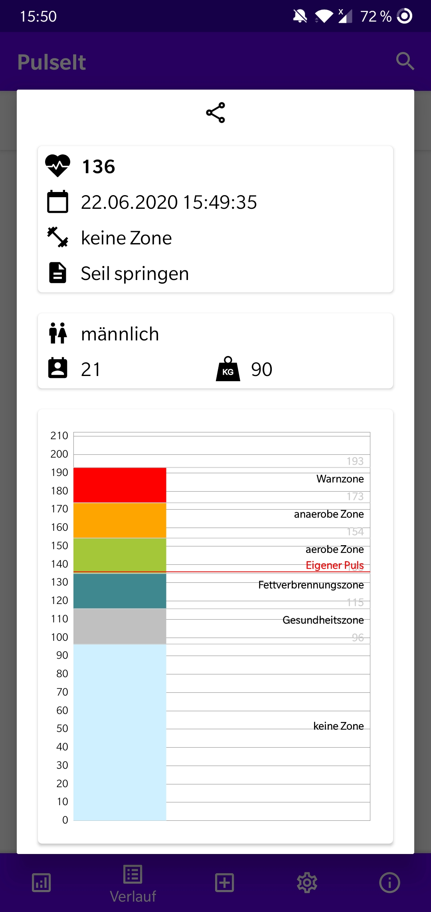
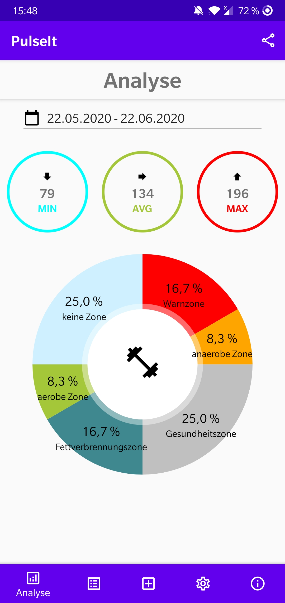
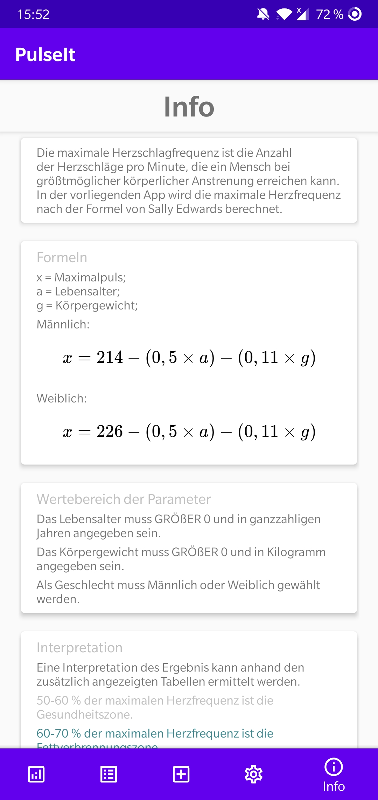
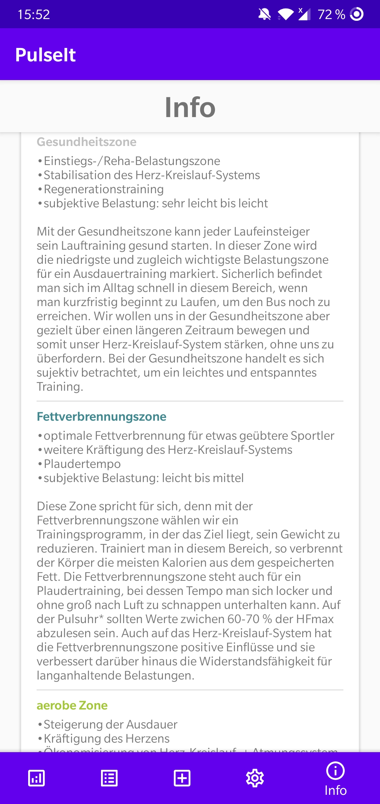

# PulseIt

PulseIt ist eine native Android App zur Berechnung des Maximalpulses anhand des Alters, Gewichts und Geschlechts einer Person.
Darüber hinaus ist es möglich gemessene Pulswerte zu speichern und analytisch aufzubereiten. Zum Beispiel kann der Minimal-, Maximal- und Durchschnittspuls in einem gewählten Zeitraum berechnet oder die Verteilung der Werte auf unterschiedliche Trainingszonen in Diagrammen dargestellt werden.

Zur Berechnung des Maximalpulses wird eine von Sally Edwards entwickelte [Formel](https://de.wikipedia.org/wiki/Maximalpuls#Sally_Edwards) verwendet.

## App-Übersicht

Die App ist in fünf Ansichten aufgeteilt.

### Einstellungen

In den Einstellungen werden die zur Berechnung der Formel benötigten Werte erhoben. Die Einstellungen sind in zwei Teile gegliedert.

#### Eingabe

Auf der Eingabeseite kann das Alter, Gewicht und Geschlecht des benutzers eingegeben und gespeichert werden.

#### Ausgabe

Auf der Ausgabeseite sind die aktuellen Einstellungen einsehbar und der berechnete Maximalpuls wird angezeigt. Aus ihm werden die verschiedenen Trainingszonen abgeleitet und in einem Diagramm dargestellt.

### Puls hinzufügen

In dieser Ansicht kann ein neuer Pulseintrag gespeichert werden. Der Wert entweder manuell angegeben werden oder wird automatisch berechnet, indem der Benutzer im Rhytmus des eigenen Herzschlags auf das Herzsymbol tappt. Zusätzlich kann eine Beschreibung angegeben werden, welche dabei hilft den Eintrag später leichter wiederzufinden oder zuzuordnen.

### Verlauf

Im Verlauf befindet sich eine Übersicht aller gespeicherten Pulseinträge nach Datum sortiert. Über das Lupensymbol kann nach dem Beschreibungstext eines Eintrags gesucht werden. Zum Löschen eines Eintrags kann dieser nach links gewischt werden. Der Löschvorgang kann im Anschluss kurzzeitig rückgängig gemacht werden.

#### Details

Wird ein Eintrag angetippt öffnet sich eine Detailansicht in der die zum Puls zugehörigen Einstellungen und Einteilung in die Trainingszonen angezeigt werden. Per Tap auf das Teilen-Symbol kann die Detailansicht als Bild in anderen Apps geteilt werden.

### Analyse

In der Analyseansicht werden der Minimal-, Maximal- und Durchschnittspuls in einem ausgewählten Zeitraum berechnet. Zudem ist die Verteilung der Pulseinträge auf die verschiedenen Trainingszonen in einem Tortendiagramm erkennbar. Per Tap auf das Teilen-Symbol kann die Analyseansicht als Bild in anderen Apps geteilt werden.

### Info

Die Infoansicht enthält informationen zur verwendeten Formel, den zulässigen Eingabewerten und Erklärungen zu den verschiedenen Trainingszonen. Außerdem enthält sie diese kleine App-Übersicht.

|                           1                           |                           2                           |
| :---------------------------------------------------: | :---------------------------------------------------: |
|  |  |

## Sonstiges

- Die App verwendet die Bibliothek [MPAndroidChart](https://github.com/PhilJay/MPAndroidChart) zur Darstellung der Diagramme
- Die Symbole stammen von der [Material Design](https://material.io/resources/icons/) Seite
- weitere Icons stammen von

---

# PulseIt (english)

PulseIt is a native Android app for calculating the maximum heart rate based on the age, weight and gender of a person.
In addition, it is possible to save measured pulse values and prepare them for analysis. For example, the minimum, maximum and average pulse can be calculated in a selected period of time or the distribution of the values across different training zones can be shown in diagrams.

A [formula](https://de.wikipedia.org/wiki/Maximalpuls#Sally_Edwards) developed by Sally Edwards is used to calculate the maximum pulse.

## App-Overview

The app is divided into five views.

### Settings

The settings required to calculate the formula are recorded in the settings view. The settings are divided into two parts.

#### Input

The age, weight and gender of the user can be entered and saved on the input page.

#### Result

The current settings can be viewed on the output page where also the calculated maximum pulse is displayed. The various training zones are derived from it and shown in a diagram.

### Add pulse

A new pulse entry can be saved in this view. The value can either be entered manually or is calculated automatically by the user tapping the heart symbol in rhythm with his own heartbeat. In addition, a description can be given, which helps to find or assign the entry later more easily.

### History

In the history view is an overview of all saved pulse entries sorted by date. The magnifying glass symbol can be used to search for the description text of an entry. To delete an entry, it can be swiped to the left. The deletion process can be undone shortly afterwards.

#### Details

If an entry is tapped, a detailed view opens in which the settings associated with the pulse and the division into the training zones are displayed. By clicking on the share icon, the detailed view can be shared as an image in other apps.

### Analytics

In the analysis view, the minimum, maximum and average pulse are calculated in a selected period. In addition, the distribution of the pulse entries across the different training zones can be seen in a pie chart. By clicking on the share icon, the analysis view can be shared as an image in other apps.

### Info

The info view contains information on the formula used, the permissible input values and explanations for the different training zones. It also contains this small app overview.

## Others

- This App uses the library [MPAndroidChart](https://github.com/PhilJay/MPAndroidChart) to display charts
- The icons are from [Material Design](https://material.io/resources/icons/)
- further icons are from